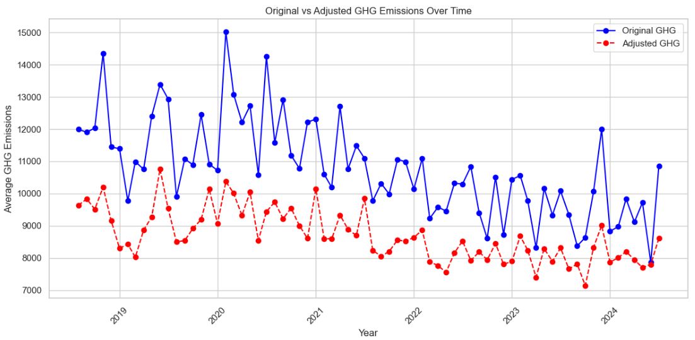

# Greenhouse Gas Emissions Analysis and Reduction Strategies

## Overview

This project analyses greenhouse gas (GHG) emissions produced by apparel factories and provides recommendations to achieve a 10% reduction in emissions by 2026. The analysis explores the relationship between production metrics and GHG emissions, identifies trends and inefficiencies, and proposes actionable strategies for improvement.

---

## Dataset

The dataset contains monthly records from six factories, covering the period from August 2018 to July 2024. Key columns include:

- **Factory**: ID identifying the factory.
- **Month**: The month of data recording.
- **GHG**: Greenhouse gas emissions (e.g., from electricity, vehicles, boilers).
- **SAH**: Standard allowed hours (time required for garment production).
- **EFF**: Efficiency ratio (expected production time vs actual time taken).
- **WH**: Total working hours (including direct and indirect production staff).
- **W**: Number of workers.

### Key Observations
- **Factory Performance**: Factories 434 and 761 exhibit the highest emissions, with lower efficiency.
- **Efficiency Correlation**: Higher efficiency is associated with lower emissions per unit of production.
- **Production Volume Impact**: Higher production hours and workforce size correlate with increased GHG emissions.

---

## Exploratory Data Analysis

### Steps Performed
1. **Data Cleaning**:
   - No missing values detected.
   - Outliers removed using the Inter-Quartile Range (IQR) method.

2. **Summary Statistics**:
   - Factory 434 has the highest production volume but lowest efficiency.
   - Factory 150 achieves the highest efficiency with moderate emissions.

3. **Trend Analysis**:
   - Factories 761 and 434 show volatile emissions, with spikes linked to production surges.
   - No consistent reduction trend observed in emissions across the factories.

4. **Correlation Analysis**:
   - Moderate positive correlation between GHG emissions and SAH (0.48).
   - Strong correlation between SAH, WH, and workforce size, highlighting their interconnectedness.

---

## Machine Learning Model

Regression models were employed to predict GHG emissions based on production metrics. Models evaluated include:

| Model                    | MSE          | R²    | CV Score       |
|--------------------------|--------------|-------|----------------|
| Linear Regressor         | 21,201,740.8 | 0.32  | 19,706,809.8   |
| Decision Tree Regressor  | 24,339,290.3 | 0.22  | 19,530,126.8   |
| Random Forest Regressor  | 7,847,981.2  | 0.75  | 10,365,542.6   |
| Extra Trees Regressor    | 7,217,825.7  | 0.77  | 9,578,253.1    |
| XGBoost                  | 7,537,813.2  | 0.76  | 12,825,296.4   |

**Best Model**: Extra Trees Regressor achieved the best performance after hyperparameter tuning:
- **MSE**: 6,421,151.6
- **R²**: 0.79
- **CV Score**: 8,268,973.6

---

## Recommendations

To meet the goal of a 10% reduction in GHG emissions by 2026, the following strategies are recommended:

1. **Optimise Production Processes**:
   - Regularly review and adjust standard allowed hours (SAH).
   - Enhance efficiency through training and standardisation.

2. **Focus on High-Emission Factories**:
   - Prioritise improvements in Factories 434 and 761.
   - Address inefficiencies and stabilise emissions in volatile factories.

3. **Leverage Best Practices**:
   - Implement strategies from low-emission factories (e.g., Factory 150).

4. **Continuous Monitoring**:
   - Track emissions trends to ensure progress towards the reduction target.

---

## Results

By increasing production efficiency by 10%, the model predicts an average reduction of 8.7% in GHG emissions, aligning closely with the 10% target.

---

## Technologies Used

- **Python**: Data analysis and visualisation.
- **Pandas**: Data manipulation.
- **Matplotlib & Seaborn**: Data visualisation.
- **Scikit-learn**: Model training and evaluation.
- **Jupyter Notebook**: Exploratory analysis.

---
